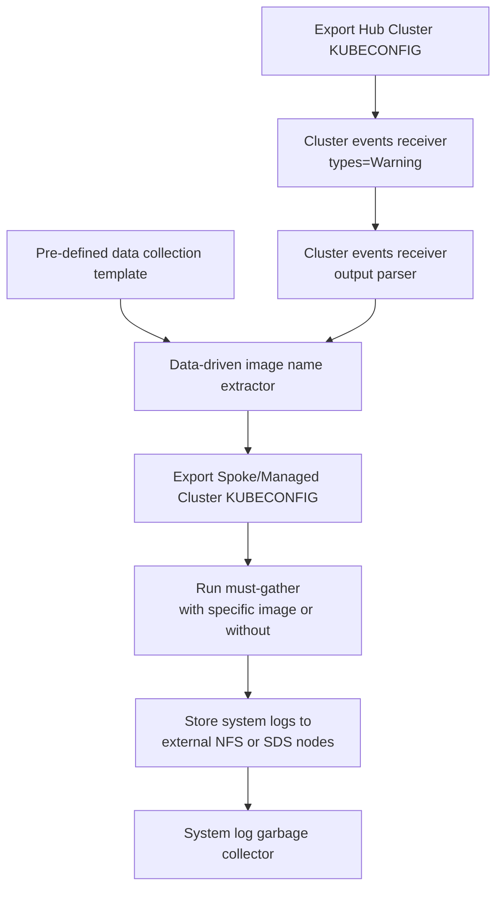
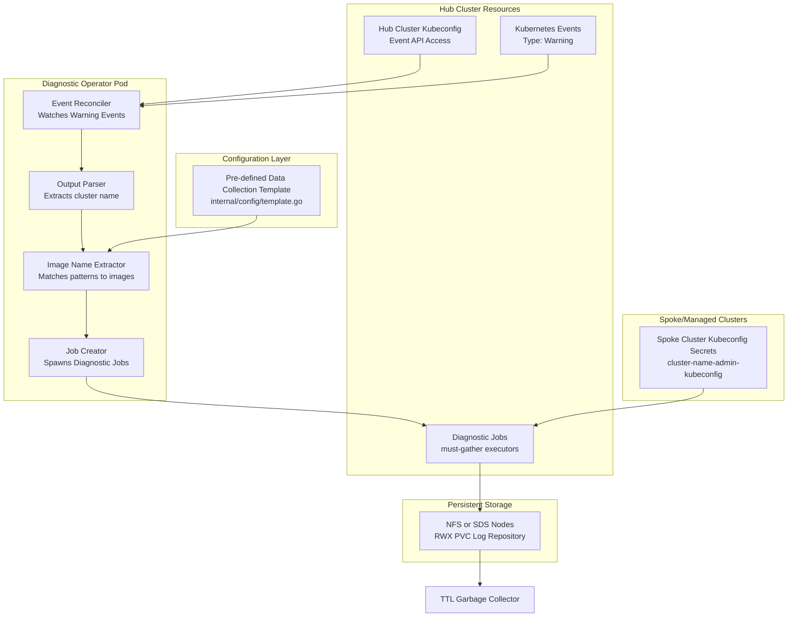
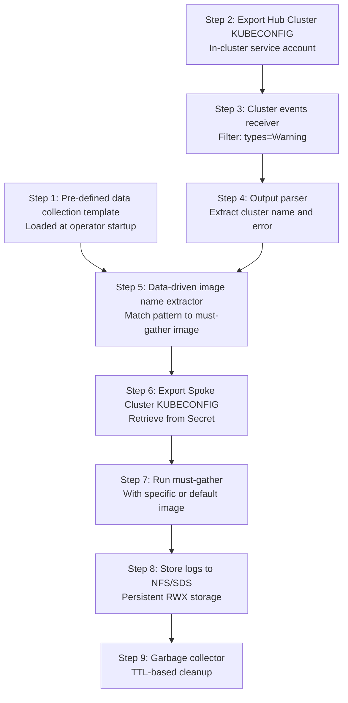

# OpenShift Event-Driven Diagnostic Operator

> An intelligent, automated diagnostic operator that monitors OpenShift Hub Cluster events, detects spoke cluster failures, and automatically launches targeted must-gather diagnostics with log persistence for root cause analysis.


---

## Table of Contents

- [Overview](#overview)
- [Architecture](#architecture)
  - [Event-Driven Workflow](#event-driven-workflow)
  - [Component Architecture](#component-architecture)
  - [How It Works](#how-it-works)
- [Features](#features)
- [Prerequisites](#prerequisites)
- [Installation](#installation)
  - [Building from Source](#building-from-source)
  - [Deploying with Kubernetes Manifests](#deploying-with-kubernetes-manifests)
  - [Verification](#verification)
- [Configuration](#configuration)
  - [Operator Flags](#operator-flags)
  - [Diagnostic Rules](#diagnostic-rules)
  - [Adding Custom Rules](#adding-custom-rules)
- [Usage & Examples](#usage--examples)
  - [Example 1: ETCD Corruption Diagnostic](#example-1-etcd-corruption-diagnostic)
  - [Example 2: Network Failure Diagnostic](#example-2-network-failure-diagnostic)
  - [Example 3: Viewing Collected Logs](#example-3-viewing-collected-logs)
- [Monitoring & Observability](#monitoring--observability)
- [Troubleshooting](#troubleshooting)
- [Development](#development)
  - [Project Structure](#project-structure)
  - [Running Locally](#running-locally)
  - [Adding New Diagnostic Rules](#adding-new-diagnostic-rules)
- [Security Considerations](#security-considerations)
- [Contributing](#contributing)
- [License](#license)

---

## Overview

The **OpenShift Event-Driven Diagnostic Operator** automates the detection and diagnosis of spoke/managed cluster failures in multi-cluster OpenShift environments. Instead of manual intervention when clusters fail, this operator:

1. **Loads** pre-defined diagnostic templates mapping error patterns to must-gather images
2. **Monitors** Hub Cluster (OpenShift with RHACM) events using hub kubeconfig for `Type=Warning` events
3. **Parses** event output to extract spoke/managed cluster name and error details
4. **Extracts** appropriate must-gather image name using data-driven template matching
5. **Retrieves** spoke/managed cluster kubeconfig from Kubernetes Secrets
6. **Spawns** lightweight Kubernetes Jobs with the matched must-gather image
7. **Executes** diagnostics on spoke cluster using mounted kubeconfig
8. **Persists** diagnostic logs to external NFS or SDS (Software Defined Storage) nodes via RWX PVC
9. **Cleans up** automatically using Kubernetes TTL-based garbage collection

This approach ensures **non-blocking operation**, **targeted diagnostics**, and **persistent log collection** without overwhelming the Hub Cluster.

### Terminology

- **Hub Cluster**: The central OpenShift cluster running RHACM (Red Hat Advanced Cluster Management) where this diagnostic operator is deployed. The Hub monitors and manages multiple spoke/managed clusters and receives their events.

- **Spoke/Managed Cluster**: Target OpenShift clusters being monitored by the Hub. These are the clusters that may experience failures and require diagnostic data collection. Also referred to as "managed clusters" in RHACM terminology.

---

## Architecture

### Event-Driven Workflow



### Component Architecture



### Detailed Implementation Flow

The following diagram shows the complete 9-step implementation flow as designed in the architecture:



### How It Works

The operator follows a 9-step implementation flow to automatically diagnose and collect logs from failing spoke/managed clusters:

#### Step 1: Pre-defined Data Collection Template

The operator loads diagnostic rules from `internal/config/template.go` at startup. These templates define regex patterns and their corresponding must-gather images.

**Code reference**: `LoadTemplates()` function in `config/template.go`

**Example rules**:
- ETCD corruption pattern → `quay.io/openshift/etcd-must-gather:latest`
- Network CNI failure pattern → `quay.io/openshift/network-must-gather:latest`
- Default fallback → `registry.redhat.io/openshift4/ose-must-gather:latest`

#### Step 2: Export Hub Cluster's KUBECONFIG

The operator runs within the Hub Cluster (OpenShift with RHACM - Red Hat Advanced Cluster Management) and uses the in-cluster service account credentials to access the Kubernetes Event API.

**Configuration**: In-cluster service account with permissions to watch Events cluster-wide

**Code reference**: `cmd/main.go` (line 47) - `ctrl.GetConfigOrDie()`

#### Step 3: Cluster Events Receiver (types=Warning)

The `EventReconciler` (in `internal/controller/event_watcher.go`) watches Kubernetes Event objects and filters only events where `Type == "Warning"`.

**Code reference**: `SetupWithManager()` function in `event_watcher.go` (lines 24-39)

**Filtering logic**:
```go
CreateFunc: func(e event.CreateEvent) bool {
    evt := e.Object.(*corev1.Event)
    return evt.Type == "Warning"
}
```

#### Step 4: Cluster Events Receiver Output Parser

When a Warning event is detected, the output parser extracts critical information from the event message, specifically:
- **Spoke/managed cluster name** (e.g., from "ClusterDeployment spoke-prod-1 failed...")
- **Error description** for pattern matching

**Code reference**: `parseClusterName()` function in `event_watcher.go` (lines 70-79)

**Example parsing**:
```
Input:  "ClusterDeployment spoke-prod-1 etcd database corruption detected"
Output: cluster name = "spoke-prod-1"
        error msg = "etcd database corruption detected"
```

#### Step 5: Data-driven Image Name Extractor

Using the pre-defined template (Step 1), the extractor matches the error message against regex patterns to determine which must-gather image to use:
- ETCD errors → `etcd-must-gather`
- Network errors → `network-must-gather`
- Storage errors → `storage-must-gather`
- Default → generic `must-gather`

**Code reference**: `determineImage()` function in `event_watcher.go` (lines 82-88)

**Matching logic**:
```go
for _, rule := range r.Rules {
    if rule.Pattern.MatchString(msg) {
        return rule.Image
    }
}
```

#### Step 6: Export Spoke/Managed Cluster's KUBECONFIG

The operator retrieves the spoke cluster's kubeconfig from a Kubernetes Secret named `{cluster-name}-admin-kubeconfig`. This kubeconfig is mounted into the diagnostic Job pod to provide access to the target spoke cluster.

**Code reference**: `job_creator.go` (lines 40-45)

**Secret format**:
- Name: `{cluster-name}-admin-kubeconfig` (e.g., `spoke-prod-1-admin-kubeconfig`)
- Namespace: `diagnostic-operator-system`
- Key: `kubeconfig`

#### Step 7: Run must-gather with Specific Image or Without

A Kubernetes Job is created that:
- Uses the image determined in Step 5
- Mounts the spoke cluster kubeconfig from Step 6
- Runs `oc adm must-gather` command against the spoke cluster
- Operates independently without blocking the operator
- Has TTL set for automatic cleanup

**Code reference**: `CreateDiagnosticJob()` in `job_creator.go` (lines 14-91)

**Job specifications**:
- ServiceAccount: `diagnostic-job-sa`
- RestartPolicy: `OnFailure`
- Command: `["adm", "must-gather", "--dest-dir=/mnt/nfs/logs/{cluster-name}"]`
- Environment: `KUBECONFIG=/etc/secret/kubeconfig`

#### Step 8: Store System Logs to External NFS or SDS Nodes

The Job pod mounts a ReadWriteMany (RWX) PersistentVolumeClaim backed by either:
- **NFS** (Network File System) - Traditional shared storage
- **SDS** (Software Defined Storage) - Ceph, Portworx, OpenEBS, OpenShift Data Foundation

Logs are written to `/mnt/nfs/logs/{cluster-name}/` ensuring persistence beyond pod lifetime and accessibility for offline root cause analysis.

**Code reference**: `job_creator.go` (lines 47-55 for PVC definition, lines 77-80 for mount)

**Storage configuration**:
- PVC name: `logs-pvc`
- Access mode: ReadWriteMany (RWX)
- Mount path: `/mnt/nfs`
- Destination: `/mnt/nfs/logs/{cluster-name}/`

#### Step 9: System Log Garbage Collector

After the diagnostic Job completes (successfully or with failure), the Kubernetes TTL (Time To Live) controller automatically deletes the Job and its pods after the configured period (default: 3600 seconds / 1 hour).

**Code reference**: `job_creator.go` (line 23) - `TTLSecondsAfterFinished`

**Cleanup behavior**:
- Successful jobs: Deleted after TTL expires
- Failed jobs: Also deleted after TTL expires (logs are already persisted)
- TTL default: 3600 seconds (1 hour)
- Customizable per deployment needs

---

## Features

- **Event-Driven Architecture**: Real-time monitoring of Hub Cluster events for `Type=Warning`
- **Smart Pattern Matching**: Regex-based template engine maps specific error patterns to specialized diagnostic images
- **Non-Blocking Job Offloading**: Spawns lightweight Kubernetes Jobs to run diagnostics asynchronously
- **Persistent Log Storage**: Mounts RWX (ReadWriteMany) storage to collect and persist logs outside ephemeral pods
- **Automatic Garbage Collection**: Uses Kubernetes TTL to automatically clean up diagnostic jobs after completion
- **Targeted Diagnostics**: Different must-gather images for different failure types (ETCD, Network, Storage, etc.)
- **Leader Election Support**: Enables high-availability deployments with multiple replicas
- **Health & Readiness Probes**: Built-in health checks for production deployments

---

## Prerequisites

| Requirement | Version/Details |
|------------|-----------------|
| **Kubernetes** | v1.28+ (based on API compatibility) |
| **OpenShift** | v4.x or v5.x |
| **Go** | 1.21+ (for building from source) |
| **Container Runtime** | Docker, Podman, or CRI-O |
| **Shared Storage** | RWX StorageClass (NFS or SDS - Software Defined Storage) |
| **Spoke/Managed Cluster Credentials** | Kubeconfig secrets in format: `{cluster-name}-admin-kubeconfig` |

**Important**: The operator requires a **ReadWriteMany (RWX)** StorageClass to allow multiple diagnostic jobs to write logs simultaneously. Common options include:
- **NFS**: `managed-nfs-storage` or custom NFS provisioners
- **SDS (Software Defined Storage)**: 
  - `ocs-storagecluster-cephfs` (OpenShift Data Foundation / Ceph)
  - Portworx shared volumes
  - OpenEBS NFS provisioner
  - Other distributed storage systems

---

## Installation

### Building from Source

1. **Clone the repository**:
```bash
git clone https://github.com/your-org/event-driven-diagnostic-operator.git
cd event-driven-diagnostic-operator
```

2. **Build the container image**:
```bash
# Using Podman
podman build -t quay.io/your-org/diagnostic-operator:v1.0.0 -f Containerfile .

# Or using Docker
docker build -t quay.io/your-org/diagnostic-operator:v1.0.0 -f Containerfile .
```

3. **Push to your container registry**:
```bash
podman push quay.io/your-org/diagnostic-operator:v1.0.0
```

### Deploying with Kubernetes Manifests

1. **Create the namespace**:
```bash
kubectl create namespace diagnostic-operator-system
```

2. **Create the ServiceAccount and RBAC**:
```bash
kubectl apply -f deploy/rbac.yaml
```

This creates:
- `diagnostic-job-sa`: ServiceAccount for diagnostic jobs
- RBAC permissions for OpenShift SecurityContextConstraints (SCC)

3. **Create the PersistentVolumeClaim for log storage**:
```bash
kubectl apply -f deploy/pvc.yaml
```

**Important**: Edit `deploy/pvc.yaml` to set your StorageClass:
```yaml
spec:
  storageClassName: managed-nfs-storage  # Change to your RWX storage class
```

Find available StorageClasses:
```bash
kubectl get storageclass
```

4. **Deploy the operator**:

Edit `deploy/deployment.yaml` to set your image:
```yaml
spec:
  template:
    spec:
      containers:
      - name: manager
        image: quay.io/your-org/diagnostic-operator:v1.0.0  # Update this
```

Then apply:
```bash
kubectl apply -f deploy/deployment.yaml
```

5. **Add operator RBAC** (if not already in rbac.yaml):

The operator needs permissions to:
- Watch Events cluster-wide
- Create Jobs in its namespace
- Access Secrets (for spoke cluster kubeconfigs)

Create a ServiceAccount for the operator:
```bash
kubectl create serviceaccount diagnostic-operator-sa -n diagnostic-operator-system
```

Create ClusterRole:
```yaml
apiVersion: rbac.authorization.k8s.io/v1
kind: ClusterRole
metadata:
  name: diagnostic-operator-role
rules:
- apiGroups: [""]
  resources: ["events"]
  verbs: ["get", "list", "watch"]
- apiGroups: [""]
  resources: ["secrets"]
  verbs: ["get", "list"]
- apiGroups: ["batch"]
  resources: ["jobs"]
  verbs: ["create", "get", "list", "watch", "delete"]
```

Bind it:
```bash
kubectl create clusterrolebinding diagnostic-operator-binding \
  --clusterrole=diagnostic-operator-role \
  --serviceaccount=diagnostic-operator-system:diagnostic-operator-sa
```

### Verification

Check that the operator is running:
```bash
kubectl get pods -n diagnostic-operator-system
```

Expected output:
```
NAME                                   READY   STATUS    RESTARTS   AGE
diagnostic-operator-7d8f9c8b5d-abcde   1/1     Running   0          30s
```

Check operator logs:
```bash
kubectl logs -n diagnostic-operator-system deployment/diagnostic-operator -f
```

You should see:
```
INFO    setup    Loaded diagnostic rules    {"count": 3}
INFO    setup    starting manager
```

---

## Configuration

### Operator Flags

The operator supports the following command-line flags (defined in `cmd/main.go`):

| Flag | Default | Description |
|------|---------|-------------|
| `--health-probe-bind-address` | `:8081` | Address for health and readiness probes |
| `--leader-elect` | `false` | Enable leader election for HA deployments |
| `--zap-devel` | `true` | Enable development logging (verbose) |
| `--zap-encoder` | `json` | Log encoding format (`json` or `console`) |

**Example**: Enable leader election and production logging:
```yaml
# In deploy/deployment.yaml
spec:
  containers:
  - name: manager
    command:
    - /manager
    - --leader-elect=true
    - --zap-devel=false
    - --zap-encoder=json
```

### Diagnostic Rules

Diagnostic rules are defined in `internal/config/template.go`. Each rule maps an error pattern to a specific must-gather image.

**Current default rules**:

| Rule Name | Pattern | Must-Gather Image |
|-----------|---------|-------------------|
| ETCD Corruption | `(?i)etcd.*database.*corruption` | `quay.io/openshift/etcd-must-gather:latest` |
| OVN Network Failure | `(?i)Network.*CNI.*failed` | `quay.io/openshift/network-must-gather:latest` |
| Default (fallback) | `.*` (matches all) | `registry.redhat.io/openshift4/ose-must-gather:latest` |

**Pattern matching is case-insensitive** (`(?i)` flag) and uses Go's `regexp` package.

### Adding Custom Rules

To add new diagnostic rules:

1. **Edit** `internal/config/template.go`:

```go
func LoadTemplates() []DiagnosticRule {
    return []DiagnosticRule{
        {
            Name:    "ETCD Corruption",
            Pattern: regexp.MustCompile(`(?i)etcd.*database.*corruption`),
            Image:   "quay.io/openshift/etcd-must-gather:latest",
        },
        {
            Name:    "OVN Network Failure",
            Pattern: regexp.MustCompile(`(?i)Network.*CNI.*failed`),
            Image:   "quay.io/openshift/network-must-gather:latest",
        },
        // ADD YOUR NEW RULE HERE
        {
            Name:    "Storage Provisioning Failure",
            Pattern: regexp.MustCompile(`(?i)StorageClass.*provision.*failed`),
            Image:   "quay.io/openshift/storage-must-gather:latest",
        },
        // Fallback default - keep this last
        {
            Name:    "Default",
            Pattern: regexp.MustCompile(`.*`),
            Image:   "",
        },
    }
}
```

2. **Rebuild** the operator image:
```bash
podman build -t quay.io/your-org/diagnostic-operator:v1.0.1 -f Containerfile .
podman push quay.io/your-org/diagnostic-operator:v1.0.1
```

3. **Update** the deployment:
```bash
kubectl set image deployment/diagnostic-operator \
  manager=quay.io/your-org/diagnostic-operator:v1.0.1 \
  -n diagnostic-operator-system
```

**Testing regex patterns**:
Use Go's regex tester or online tools like [regex101.com](https://regex101.com/) with flavor set to "Golang".

---

## Usage & Examples

### Example 1: ETCD Corruption Diagnostic

Create a Warning event that simulates an ETCD corruption:

```yaml
apiVersion: v1
kind: Event
metadata:
  name: test-etcd-failure
  namespace: default
type: Warning
reason: ETCDCorruption
message: "ClusterDeployment spoke-prod-1 etcd database corruption detected"
involvedObject:
  kind: ClusterDeployment
  name: spoke-prod-1
```

Apply the event:
```bash
kubectl apply -f test-etcd-event.yaml
```

**Expected outcome**:
1. Operator detects the Warning event
2. Extracts cluster name: `spoke-prod-1`
3. Matches pattern: `(?i)etcd.*database.*corruption`
4. Creates Job using image: `quay.io/openshift/etcd-must-gather:latest`
5. Job writes logs to: `/mnt/nfs/logs/spoke-prod-1/`

Verify the job was created:
```bash
kubectl get jobs -n diagnostic-operator-system
```

### Example 2: Network Failure Diagnostic

Simulate a CNI network failure:

```yaml
apiVersion: v1
kind: Event
metadata:
  name: test-network-failure
  namespace: default
type: Warning
reason: NetworkFailure
message: "ClusterDeployment spoke-dev-2 Network CNI plugin failed to initialize"
involvedObject:
  kind: ClusterDeployment
  name: spoke-dev-2
```

**Expected outcome**:
- Creates Job with network-must-gather image
- Logs written to: `/mnt/nfs/logs/spoke-dev-2/`

### Example 3: Viewing Collected Logs

Access the NFS storage to view diagnostic logs:

**Option 1**: From within the cluster:
```bash
# Create a debug pod with NFS mount
kubectl run -it --rm nfs-viewer \
  --image=busybox \
  --overrides='
  {
    "spec": {
      "containers": [{
        "name": "nfs-viewer",
        "image": "busybox",
        "command": ["sh"],
        "volumeMounts": [{
          "name": "logs",
          "mountPath": "/logs"
        }]
      }],
      "volumes": [{
        "name": "logs",
        "persistentVolumeClaim": {
          "claimName": "logs-pvc"
        }
      }]
    }
  }' \
  -n diagnostic-operator-system

# Inside the pod
ls /logs/
# Output: spoke-prod-1/  spoke-dev-2/

ls /logs/spoke-prod-1/
# Output: must-gather.tar.gz  timestamp  ...
```

**Option 2**: From the NFS server directly:
```bash
# SSH to your NFS server
ssh nfs-server.example.com

# Navigate to the exported path
cd /exports/logs
ls -lh
```

**Option 3**: Copy logs to local machine:
```bash
# Get a running operator pod name
POD=$(kubectl get pod -n diagnostic-operator-system -l app=diagnostic-operator -o jsonpath='{.items[0].metadata.name}')

# Copy logs from PVC via operator pod
kubectl exec -n diagnostic-operator-system $POD -- tar czf - /mnt/nfs/logs/spoke-prod-1 | tar xzf -
```

---

## Monitoring & Observability

### Health & Readiness Checks

The operator exposes health and readiness endpoints (configured in `cmd/main.go`):

| Endpoint | Port | Purpose |
|----------|------|---------|
| `/healthz` | 8081 | Liveness probe - checks if operator is alive |
| `/readyz` | 8081 | Readiness probe - checks if operator is ready to serve |

**Kubernetes probe configuration**:
```yaml
# Add to deploy/deployment.yaml
spec:
  containers:
  - name: manager
    livenessProbe:
      httpGet:
        path: /healthz
        port: 8081
      initialDelaySeconds: 15
      periodSeconds: 20
    readinessProbe:
      httpGet:
        path: /readyz
        port: 8081
      initialDelaySeconds: 5
      periodSeconds: 10
```

### Leader Election Status

When leader election is enabled (`--leader-elect=true`), only one replica actively reconciles events. Check leader election status:

```bash
kubectl get lease -n diagnostic-operator-system
kubectl describe lease diagnostic-operator.example.com -n diagnostic-operator-system
```

### Metrics to Monitor

While the operator doesn't expose Prometheus metrics by default, monitor these Kubernetes metrics:

1. **Events Processed**: Count of reconcile loops
```bash
kubectl logs -n diagnostic-operator-system deployment/diagnostic-operator | grep "Reconcile"
```

2. **Jobs Created**: Number of diagnostic jobs
```bash
kubectl get jobs -n diagnostic-operator-system --show-labels
```

3. **Job Success/Failure Rate**:
```bash
kubectl get jobs -n diagnostic-operator-system -o json | \
  jq '.items[] | select(.status.conditions[].type=="Complete") | .metadata.name'
```

4. **Storage Usage**:
```bash
kubectl exec -n diagnostic-operator-system deployment/diagnostic-operator -- \
  df -h /mnt/nfs
```

5. **Job Cleanup Status** (TTL controller):
```bash
kubectl get jobs -n diagnostic-operator-system -o wide
# Jobs should auto-delete 1 hour after completion
```

### Logging

View operator logs:
```bash
kubectl logs -n diagnostic-operator-system deployment/diagnostic-operator -f
```

Log levels can be adjusted with zap flags:
- Development mode: `--zap-devel=true` (verbose, includes stack traces)
- Production mode: `--zap-devel=false` (structured JSON logs)

---

## Troubleshooting

### Issue #1: Events Not Triggering Jobs

**Symptoms**: Warning events are created but no diagnostic jobs appear.

**Diagnosis**:
```bash
# Check operator logs for reconcile events
kubectl logs -n diagnostic-operator-system deployment/diagnostic-operator | grep "Reconcile"

# Verify events are visible to the operator
kubectl get events --all-namespaces --field-selector type=Warning
```

**Common causes**:
1. **Event type mismatch**: Ensure event has `type: Warning` (case-sensitive)
2. **Cluster name not parsed**: The `parseClusterName()` function looks for "ClusterDeployment" in the message (line 70-79 in `event_watcher.go`)
   - Example: `"ClusterDeployment spoke-1 failed"` ✅
   - Example: `"spoke-1 failed"` ❌ (won't extract cluster name)
3. **RBAC permissions**: Verify operator has permission to watch Events
```bash
kubectl auth can-i watch events --as=system:serviceaccount:diagnostic-operator-system:diagnostic-operator-sa
```

**Fix**:
Ensure event message format includes "ClusterDeployment" followed by the cluster name:
```yaml
message: "ClusterDeployment <cluster-name> <error description>"
```

### Issue #2: Jobs Fail to Start

**Symptoms**: Jobs are created but pods remain in `Pending` or `Error` state.

**Diagnosis**:
```bash
# List jobs
kubectl get jobs -n diagnostic-operator-system

# Check job details
kubectl describe job <job-name> -n diagnostic-operator-system

# Check pod status
kubectl get pods -n diagnostic-operator-system
kubectl describe pod <pod-name> -n diagnostic-operator-system
```

**Common causes**:

1. **ServiceAccount missing**: Job requires `diagnostic-job-sa`
```bash
kubectl get serviceaccount diagnostic-job-sa -n diagnostic-operator-system
```
**Fix**: Apply `deploy/rbac.yaml`

2. **Kubeconfig secret not found**: Job expects secret named `{cluster-name}-admin-kubeconfig`
```bash
# Check if secret exists
kubectl get secret spoke-prod-1-admin-kubeconfig -n diagnostic-operator-system
```
**Fix**: Create the secret with spoke/managed cluster kubeconfig:
```bash
kubectl create secret generic spoke-prod-1-admin-kubeconfig \
  --from-file=kubeconfig=/path/to/spoke-cluster-kubeconfig \
  -n diagnostic-operator-system
```

3. **PVC not bound**: Logs PVC must be in `Bound` state
```bash
kubectl get pvc logs-pvc -n diagnostic-operator-system
```
**Fix**: See Issue #3 below

4. **Image pull errors**: Unable to pull must-gather image
```bash
kubectl describe pod <pod-name> -n diagnostic-operator-system | grep -A5 "Events:"
```
**Fix**: Verify image exists and add imagePullSecrets if using private registry

### Issue #3: PVC Remains in Pending State

**Symptoms**: `logs-pvc` PersistentVolumeClaim stuck in `Pending`.

**Diagnosis**:
```bash
kubectl describe pvc logs-pvc -n diagnostic-operator-system
```

**Common causes**:
1. **StorageClass not found**: The `storageClassName` in `deploy/pvc.yaml` doesn't match cluster
```bash
kubectl get storageclass
```
**Fix**: Edit `deploy/pvc.yaml` and set a valid StorageClass:
```yaml
spec:
  storageClassName: ocs-storagecluster-cephfs  # Use your cluster's RWX class
```

2. **No RWX provisioner**: Cluster lacks ReadWriteMany storage
```bash
kubectl get storageclass -o custom-columns=NAME:.metadata.name,MODES:.allowedTopologies
```
**Fix**: Install NFS provisioner or SDS solution:
- NFS: Deploy NFS provisioner or use external NFS server
- SDS: Install Ceph (OpenShift Data Foundation), Portworx, or OpenEBS
- Cloud: Use cloud provider's shared file storage (EFS, Azure Files, etc.)

3. **Insufficient storage**: Not enough capacity in storage backend
**Fix**: Reduce PVC size or add storage capacity

### Issue #4: Logs Not Persisting

**Symptoms**: Jobs complete successfully but logs are missing from storage.

**Diagnosis**:
```bash
# Check if NFS is mounted in job pod
kubectl exec -n diagnostic-operator-system <job-pod-name> -- df -h /mnt/nfs

# Check directory permissions
kubectl exec -n diagnostic-operator-system <job-pod-name> -- ls -la /mnt/nfs/logs/
```

**Common causes**:
1. **Mount point permissions**: NFS export has restrictive permissions
**Fix**: On NFS server, ensure export allows writes:
```bash
# On NFS server
chmod 777 /exports/logs
chown nfsnobody:nfsnobody /exports/logs
```

2. **Must-gather fails**: The must-gather command itself fails
```bash
# Check job logs
kubectl logs -n diagnostic-operator-system <job-pod-name>
```
**Fix**: Verify spoke/managed cluster kubeconfig is valid and has admin permissions

3. **Path mismatch**: Logs written to wrong directory
- Job writes to: `/mnt/nfs/logs/{cluster-name}/`
- Verify in job_creator.go line 63: `--dest-dir=/mnt/nfs/logs/` + clusterName

### Issue #5: Jobs Not Cleaning Up

**Symptoms**: Completed jobs remain indefinitely instead of auto-deleting.

**Diagnosis**:
```bash
kubectl get jobs -n diagnostic-operator-system
# Jobs should disappear ~1 hour after completion
```

**Common causes**:
1. **TTL controller disabled**: Kubernetes cluster must have TTL controller enabled
```bash
kubectl get pods -n kube-system | grep ttl
```
**Fix**: Enable TTL controller in cluster (varies by distribution)

2. **TTL not set**: Job doesn't have `TTLSecondsAfterFinished`
```bash
kubectl get job <job-name> -n diagnostic-operator-system -o yaml | grep ttlSecondsAfterFinished
```
**Fix**: This should be automatic (see `job_creator.go` line 23). If missing, check operator version.

3. **Job still running**: TTL only applies to completed/failed jobs
```bash
kubectl describe job <job-name> -n diagnostic-operator-system
```

**Manual cleanup**:
```bash
# Delete old jobs manually
kubectl delete jobs -n diagnostic-operator-system --field-selector status.successful=1
```

### Issue #6: Permission Denied on NFS Mount (OpenShift)

**Symptoms**: Pods fail with "Permission denied" when writing to NFS.

**Cause**: OpenShift Security Context Constraints (SCC) restrict NFS mounts.

**Fix**: Grant SCC permissions in `deploy/rbac.yaml`:
```yaml
apiVersion: rbac.authorization.k8s.io/v1
kind: ClusterRole
metadata:
  name: diagnostic-scc-role
rules:
  - apiGroups: ["security.openshift.io"]
    resources: ["securitycontextconstraints"]
    resourceNames: ["privileged"]  # or "hostmount-anyuid"
    verbs: ["use"]
```

Then bind to ServiceAccount:
```bash
oc adm policy add-scc-to-user privileged -z diagnostic-job-sa -n diagnostic-operator-system
```

---

## Development

### Project Structure

```
event-driven-diagnostic-operator/
├── cmd/
│   └── main.go                       # Entrypoint: Initializes controller-runtime Manager
├── internal/
│   ├── config/
│   │   └── template.go               # Diagnostic rule definitions (regex patterns)
│   └── controller/
│       ├── event_watcher.go          # EventReconciler: Watches Events, filters, parses
│       └── job_creator.go            # Job creation logic with NFS mounts and TTL
├── deploy/
│   ├── rbac.yaml                     # ServiceAccount, Role, RoleBinding for jobs
│   ├── pvc.yaml                      # PersistentVolumeClaim for log storage
│   └── deployment.yaml               # Operator Deployment manifest
├── Containerfile                     # Multi-stage build (Go build → UBI minimal)
├── go.mod                            # Go module dependencies
└── README.md                         # This file
```

### Running Locally

To run the operator code locally (outside the cluster) while connecting to your current kubecontext:

1. **Ensure kubeconfig is set**:
```bash
export KUBECONFIG=~/.kube/config
kubectl cluster-info
```

2. **Run the operator**:
```bash
go run cmd/main.go
```

The operator will:
- Connect to your current cluster
- Start watching Events
- Create jobs in the cluster when Warning events are detected

**Note**: You still need the PVC and RBAC resources deployed in the cluster.

### Testing with Simulated Events

Create test Warning events to trigger diagnostics:

```bash
# Create ETCD failure event
kubectl apply -f - <<EOF
apiVersion: v1
kind: Event
metadata:
  name: test-etcd-$(date +%s)
  namespace: default
type: Warning
reason: ETCDCorruption
message: "ClusterDeployment test-cluster-1 etcd database corruption detected"
involvedObject:
  kind: ClusterDeployment
  name: test-cluster-1
EOF

# Watch operator logs
kubectl logs -f -n diagnostic-operator-system deployment/diagnostic-operator

# Verify job creation
kubectl get jobs -n diagnostic-operator-system
```

### Adding New Diagnostic Rules

1. **Identify the error pattern**: Look at actual Warning event messages from your cluster
```bash
kubectl get events --all-namespaces --field-selector type=Warning
```

2. **Write regex pattern**: Create a pattern that uniquely identifies the error
```go
Pattern: regexp.MustCompile(`(?i)keyword1.*keyword2.*specific-error`),
```

3. **Find appropriate must-gather image**: Check available must-gather images:
- General: `registry.redhat.io/openshift4/ose-must-gather:latest`
- ETCD: `quay.io/openshift/etcd-must-gather:latest`
- Network: `quay.io/openshift/network-must-gather:latest`
- Storage: `quay.io/openshift/storage-must-gather:latest`
- Custom: Build your own must-gather image

4. **Add rule to template.go**:
```go
{
    Name:    "Your Error Type",
    Pattern: regexp.MustCompile(`(?i)your.*regex.*pattern`),
    Image:   "quay.io/your-org/your-must-gather:latest",
},
```

5. **Test the pattern**: Use Go's testing framework
```go
// internal/config/template_test.go
func TestPatternMatching(t *testing.T) {
    rules := LoadTemplates()
    message := "ClusterDeployment test your actual error message"
    
    for _, rule := range rules {
        if rule.Pattern.MatchString(message) {
            t.Logf("Matched rule: %s with image: %s", rule.Name, rule.Image)
            break
        }
    }
}
```

6. **Rebuild and deploy**:
```bash
podman build -t quay.io/your-org/diagnostic-operator:v1.1.0 -f Containerfile .
podman push quay.io/your-org/diagnostic-operator:v1.1.0
kubectl set image deployment/diagnostic-operator manager=quay.io/your-org/diagnostic-operator:v1.1.0 -n diagnostic-operator-system
```

### Debugging Tips

1. **Enable verbose logging**:
```bash
# In deploy/deployment.yaml, add flag
args: ["--zap-devel=true", "--zap-log-level=2"]
```

2. **Check controller-runtime events**:
```bash
kubectl get events -n diagnostic-operator-system --sort-by='.lastTimestamp'
```

3. **Inspect reconcile loops**:
```bash
kubectl logs -n diagnostic-operator-system deployment/diagnostic-operator | grep "Reconcile"
```

4. **Test regex patterns online**: Use [regex101.com](https://regex101.com/) with flavor "Golang"

5. **Check job pod logs**:
```bash
# Get most recent job
JOB=$(kubectl get jobs -n diagnostic-operator-system --sort-by=.metadata.creationTimestamp -o jsonpath='{.items[-1].metadata.name}')

# Get pod from job
POD=$(kubectl get pods -n diagnostic-operator-system -l job-name=$JOB -o jsonpath='{.items[0].metadata.name}')

# View logs
kubectl logs -n diagnostic-operator-system $POD
```

---

## Security Considerations

### ServiceAccount Permissions

The operator uses two ServiceAccounts:

1. **diagnostic-operator-sa** (operator itself):
   - ClusterRole with permissions to:
     - `watch`, `get`, `list` Events (cluster-wide)
     - `create`, `get`, `list`, `watch`, `delete` Jobs (namespaced)
     - `get`, `list` Secrets (for spoke/managed cluster kubeconfigs)

2. **diagnostic-job-sa** (diagnostic jobs):
   - Role with permissions to:
     - `use` SecurityContextConstraints for NFS mounting (OpenShift only)

**Principle of least privilege**: Both ServiceAccounts have minimal permissions required for their function.

### Spoke/Managed Cluster Credentials

Spoke/managed cluster kubeconfigs are stored as Secrets in the Hub Cluster. Best practices:

1. **Namespace isolation**: Store secrets in `diagnostic-operator-system` namespace
2. **Access control**: Only operator ServiceAccount can read these secrets
3. **Rotation**: Regularly rotate spoke/managed cluster credentials
4. **Audit**: Enable audit logging for Secret access

```bash
# Create spoke/managed cluster kubeconfig secret
kubectl create secret generic spoke-prod-1-admin-kubeconfig \
  --from-file=kubeconfig=/path/to/spoke-kubeconfig \
  -n diagnostic-operator-system

# Verify secret is not readable by default ServiceAccount
kubectl auth can-i get secret spoke-prod-1-admin-kubeconfig \
  --as=system:serviceaccount:diagnostic-operator-system:default
# Should return "no"
```

### Network Policies

Restrict network access for the operator and diagnostic jobs:

```yaml
apiVersion: networking.k8s.io/v1
kind: NetworkPolicy
metadata:
  name: diagnostic-operator-netpol
  namespace: diagnostic-operator-system
spec:
  podSelector:
    matchLabels:
      app: diagnostic-operator
  policyTypes:
  - Ingress
  - Egress
  ingress:
  - from:
    - namespaceSelector:
        matchLabels:
          name: monitoring  # Allow Prometheus scraping
    ports:
    - protocol: TCP
      port: 8081  # Health checks
  egress:
  - to:
    - namespaceSelector: {}  # Allow access to Kubernetes API
  - to:
    - podSelector: {}  # Allow NFS access
    ports:
    - protocol: TCP
      port: 2049  # NFS
```

### Pod Security Standards

The operator follows Pod Security Standards (PSS):

- **Runs as non-root user**: UID 65532 (defined in Containerfile)
- **Read-only root filesystem**: Can be enabled by adding:
  ```yaml
  securityContext:
    readOnlyRootFilesystem: true
  ```
- **Dropped capabilities**: No special capabilities required
- **No privileged escalation**: `allowPrivilegeEscalation: false`

Apply Pod Security Standards to namespace:
```bash
kubectl label namespace diagnostic-operator-system \
  pod-security.kubernetes.io/enforce=restricted \
  pod-security.kubernetes.io/audit=restricted \
  pod-security.kubernetes.io/warn=restricted
```

### OpenShift Security Context Constraints (SCC)

For OpenShift deployments, diagnostic jobs may need elevated SCC for NFS mounts:

```bash
# Grant privileged SCC to job ServiceAccount
oc adm policy add-scc-to-user privileged -z diagnostic-job-sa -n diagnostic-operator-system

# Or use less privileged hostmount-anyuid if sufficient
oc adm policy add-scc-to-user hostmount-anyuid -z diagnostic-job-sa -n diagnostic-operator-system
```

**Security trade-off**: NFS mounting typically requires elevated permissions. Consider:
- Using CSI drivers that don't require privileged SCC
- Restricting job pod capabilities with `securityContext.capabilities.drop: [ALL]`
- Implementing Pod Security Policies or OPA/Gatekeeper rules

### Image Security

- **Base image**: Uses Red Hat UBI (Universal Base Image) minimal for security updates
- **Image scanning**: Scan images with tools like Trivy, Clair, or Red Hat Quay
- **Image signing**: Sign images and use admission controllers to verify signatures

```bash
# Scan image with Trivy
trivy image quay.io/your-org/diagnostic-operator:v1.0.0
```

---

## Contributing

We welcome contributions to improve the OpenShift Event-Driven Diagnostic Operator!

### How to Contribute

1. **Fork the repository**
2. **Create a feature branch**: `git checkout -b feature/your-feature-name`
3. **Make your changes**:
   - Add new diagnostic rules
   - Improve error handling
   - Enhance documentation
   - Add tests
4. **Test your changes**: Run locally and verify functionality
5. **Commit your changes**: Use descriptive commit messages
   ```bash
   git commit -m "Add storage provisioning diagnostic rule"
   ```
6. **Push to your fork**: `git push origin feature/your-feature-name`
7. **Open a Pull Request**: Describe your changes and link any related issues

### Code Style Guidelines

- Follow Go standard formatting: `go fmt ./...`
- Add comments for exported functions and types
- Use descriptive variable names
- Keep functions focused and single-purpose
- Add logging for important operations

### Testing Guidelines

- Test regex patterns thoroughly with various event messages
- Verify jobs are created correctly with proper mounts
- Test TTL cleanup behavior
- Check error handling and edge cases

### Reporting Issues

When reporting issues, please include:

1. **Operator version**: Image tag or git commit
2. **Kubernetes/OpenShift version**: `kubectl version`
3. **Symptom description**: What's not working?
4. **Steps to reproduce**: How to trigger the issue
5. **Logs**: Operator logs and job pod logs
   ```bash
   kubectl logs -n diagnostic-operator-system deployment/diagnostic-operator
   ```
6. **Event details**: The Warning event that triggered the issue
   ```bash
   kubectl get event <event-name> -o yaml
   ```

### Roadmap & Future Enhancements

Potential improvements:

- [ ] **Dynamic rule configuration**: CRD-based rule management without rebuilds
- [ ] **Prometheus metrics**: Export metrics for events processed, jobs created, success/failure rates
- [ ] **Alert manager integration**: Send notifications when diagnostics complete or fail
- [ ] **Multi-cluster spoke monitoring**: Direct connection to spoke clusters instead of kubeconfig secrets
- [ ] **Log analysis**: Automated parsing and analysis of must-gather output
- [ ] **Web UI**: Dashboard for viewing diagnostic status and logs
- [ ] **S3 storage backend**: Support for object storage in addition to NFS
- [ ] **Job priority**: Priority queue for critical cluster failures
- [ ] **Retry logic**: Automatic retry for failed diagnostic jobs
- [ ] **Garbage collection tuning**: Configurable TTL per rule

---

## License

This project is licensed under the **Apache License 2.0**.

See the [LICENSE](LICENSE) file for full license text.

```
Copyright 2024-2026 OpenShift Diagnostic Operator Contributors

Licensed under the Apache License, Version 2.0 (the "License");
you may not use this file except in compliance with the License.
You may obtain a copy of the License at

    http://www.apache.org/licenses/LICENSE-2.0

Unless required by applicable law or agreed to in writing, software
distributed under the License is distributed on an "AS IS" BASIS,
WITHOUT WARRANTIES OR CONDITIONS OF ANY KIND, either express or implied.
See the License for the specific language governing permissions and
limitations under the License.
```

---

## Acknowledgments

- Built with [controller-runtime](https://github.com/kubernetes-sigs/controller-runtime) framework
- Inspired by OpenShift's [must-gather](https://github.com/openshift/must-gather) diagnostic tool
- Uses [Red Hat Universal Base Image (UBI)](https://www.redhat.com/en/blog/introducing-red-hat-universal-base-image) for container runtime

---

## Support & Community

- **Issues**: [GitHub Issues](https://github.com/your-org/event-driven-diagnostic-operator/issues)
- **Discussions**: [GitHub Discussions](https://github.com/your-org/event-driven-diagnostic-operator/discussions)
- **Email**: pmohanra@redhat.com

---

